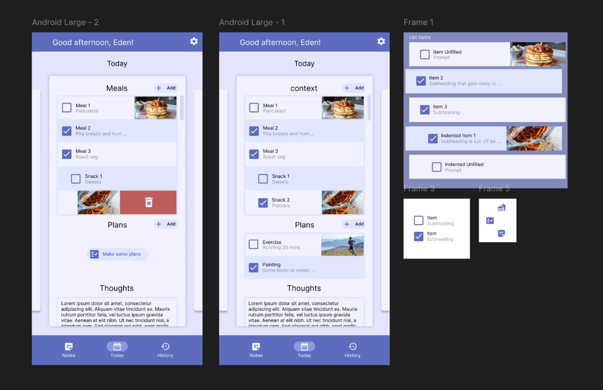

# Sereal

Keep track of what matters. Ignore what doesn't.



## Project Status

I started this 2 years ago for my partner. ADHD and life got in the way. Now we're on the road again.

**Major refactor to align to a new architecture, database plugin, and more. Ignore the mess!**

PRs, comments, etc. welcome when I've got this working in a decent state.

## Getting Started

Currently building against flutter 3.35.1.

```sh
# run code generation with my nifty lil shell script
./build

# run the app
flutter run
```

## License

TBD.
